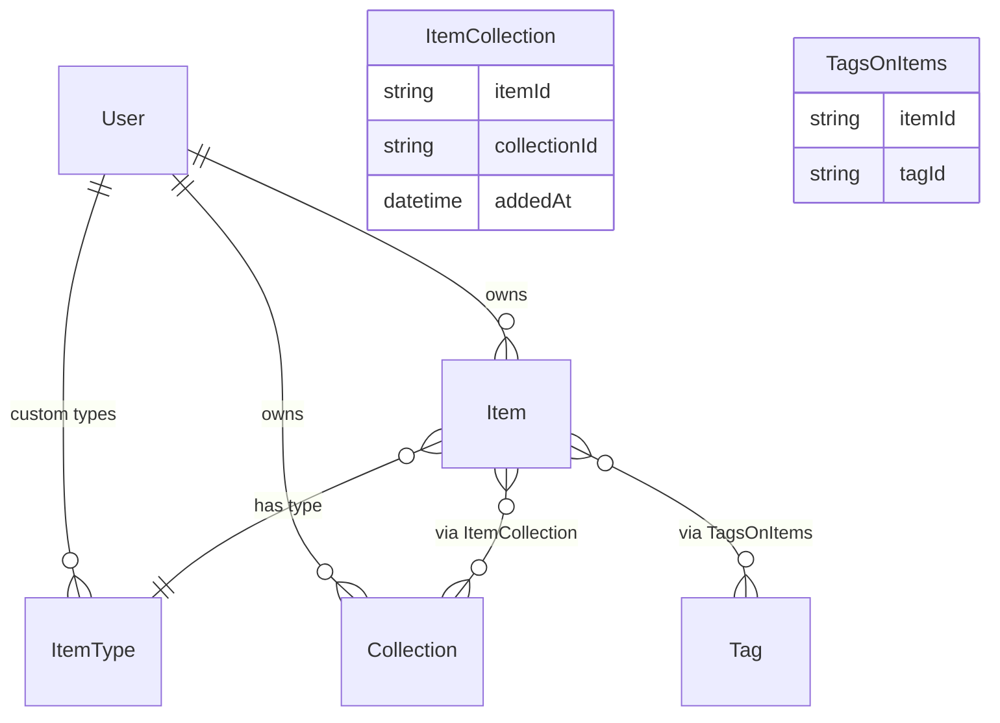

# DevStash — Project Overview

A developer knowledge hub for snippets, commands, prompts, notes, files, images, and links. One fast, searchable, AI-enhanced place for all dev knowledge.

---

## Problem

Developers keep essentials scattered across VS Code, Notion, browser bookmarks, bash history, GitHub Gists, and random folders. This causes context switching, lost knowledge, and inconsistent workflows.

---

## Target Users

| User | Need |
| ---- | ---- |
| Everyday Developer | Fast access to snippets, commands, links |
| AI-first Developer | Saves prompts, system messages, context files, workflows |
| Content Creator / Educator | Code blocks, explanations, course notes |
| Full-stack Builder | Patterns, boilerplates, API examples |

---

## Tech Stack

| Layer | Technology |
| ----- | ---------- |
| Framework | [Next.js 16](https://nextjs.org/docs) / [React 19](https://react.dev) |
| Language | [TypeScript](https://www.typescriptlang.org/docs/) |
| Database | [Neon](https://neon.tech/docs) (PostgreSQL) |
| ORM | [Prisma 7](https://www.prisma.io/docs) |
| Auth | [NextAuth v5](https://authjs.dev/getting-started) (email/password + GitHub OAuth) |
| CSS | [Tailwind CSS v4](https://tailwindcss.com/docs) + [ShadCN UI](https://ui.shadcn.com) |
| File Storage | [Cloudflare R2](https://developers.cloudflare.com/r2/) |
| AI | [OpenAI](https://platform.openai.com/docs) `gpt-4o-mini` |
| Icons | [Lucide React](https://lucide.dev/icons/) |

> **DB Rule**: Never use `db push`. Always create and run migrations.

---

## Features

### A. Item Types

Items have a type. System types are read-only. Custom types are Pro only (future).

| Type | Icon | Color | URL Slug | Content |
| ---- | ---- | ----- | -------- | ------- |
| Snippet | `Code` | `#3b82f6` blue | `/items/snippets` | text |
| Prompt | `Sparkles` | `#8b5cf6` purple | `/items/prompts` | text |
| Command | `Terminal` | `#f97316` orange | `/items/commands` | text |
| Note | `StickyNote` | `#fde047` yellow | `/items/notes` | text |
| File | `File` | `#6b7280` gray | `/items/files` | file (Pro) |
| Image | `Image` | `#ec4899` pink | `/items/images` | file (Pro) |
| Link | `Link` | `#10b981` emerald | `/items/links` | url |

Items open in a quick-access **drawer** for fast create/view.

### B. Collections

Named groups that hold items of any type. An item can belong to multiple collections.

Examples: `React Patterns`, `Python Snippets`, `Context Files`, `Interview Prep`

### C. Search

Full-text search across: title, content, tags, type.

### D. Authentication

Email/password and GitHub OAuth via NextAuth v5.

### E. Core Features

- Favorite items and collections
- Pin items to top
- Recently used items
- Import code from a file
- Markdown editor for text types
- File upload for file/image types
- Export data (JSON / ZIP) — Pro
- Add/remove items to/from multiple collections
- View which collections an item belongs to
- Dark mode default, light mode optional

### F. AI Features (Pro only)

- Auto-tag suggestions
- Item summaries
- Explain This Code
- Prompt optimizer

---

## Monetization

> During development, all users have full access.

| Plan | Price           | Limits                                                                   |
| ---- | --------------- | ------------------------------------------------------------------------ |
| Free | $0              | 50 items, 3 collections, no files/images, no AI                          |
| Pro  | $8/mo or $72/yr | Unlimited items & collections, files, AI, export, custom types (future)  |

Stripe for payments — `stripeCustomerId` and `stripeSubscriptionId` stored on `User`.

---

## Data Models

### Prisma Schema

```prisma
enum ContentType {
  text
  file
  url
}

model User {
  id                   String       @id @default(cuid())
  name                 String?
  email                String?      @unique
  emailVerified        DateTime?
  image                String?
  isPro                Boolean      @default(false)
  stripeCustomerId     String?      @unique
  stripeSubscriptionId String?      @unique
  createdAt            DateTime     @default(now())
  updatedAt            DateTime     @updatedAt
  items                Item[]
  collections          Collection[]
  itemTypes            ItemType[]
  accounts             Account[]
  sessions             Session[]
}

model Item {
  id          String           @id @default(cuid())
  title       String
  contentType ContentType
  content     String?          @db.Text
  fileUrl     String?
  fileName    String?
  fileSize    Int?
  url         String?
  description String?
  isFavorite  Boolean          @default(false)
  isPinned    Boolean          @default(false)
  language    String?
  createdAt   DateTime         @default(now())
  updatedAt   DateTime         @updatedAt
  userId      String
  user        User             @relation(fields: [userId], references: [id], onDelete: Cascade)
  typeId      String
  type        ItemType         @relation(fields: [typeId], references: [id])
  tags        TagsOnItems[]
  collections ItemCollection[]
}

model ItemType {
  id       String  @id @default(cuid())
  name     String
  icon     String
  color    String
  isSystem Boolean @default(false)
  userId   String?
  user     User?   @relation(fields: [userId], references: [id], onDelete: Cascade)
  items    Item[]
}

model Collection {
  id            String           @id @default(cuid())
  name          String
  description   String?
  isFavorite    Boolean          @default(false)
  defaultTypeId String?
  createdAt     DateTime         @default(now())
  updatedAt     DateTime         @updatedAt
  userId        String
  user          User             @relation(fields: [userId], references: [id], onDelete: Cascade)
  items         ItemCollection[]
}

model ItemCollection {
  itemId       String
  collectionId String
  addedAt      DateTime   @default(now())
  item         Item       @relation(fields: [itemId], references: [id], onDelete: Cascade)
  collection   Collection @relation(fields: [collectionId], references: [id], onDelete: Cascade)

  @@id([itemId, collectionId])
}

model Tag {
  id    String        @id @default(cuid())
  name  String        @unique
  items TagsOnItems[]
}

model TagsOnItems {
  itemId String
  tagId  String
  item   Item   @relation(fields: [itemId], references: [id], onDelete: Cascade)
  tag    Tag    @relation(fields: [tagId], references: [id], onDelete: Cascade)

  @@id([itemId, tagId])
}
```

---

## Entity Relationship Diagram



---

## UI / UX

### Layout

```text
+------------------+----------------------------------------+
|  Sidebar         |  Main Content                          |
|                  |                                        |
|  Item Types      |  Collections grid (color-coded cards)  |
|  - Snippets      |                                        |
|  - Commands      |  Items grid (color-coded border cards) |
|  - Prompts       |                                        |
|  - Notes         |  [Item opens in Drawer]                |
|  - Links         |                                        |
|  - Files (Pro)   |                                        |
|  - Images (Pro)  |                                        |
|                  |                                        |
|  Collections     |                                        |
|  (latest)        |                                        |
+------------------+----------------------------------------+
```

- Sidebar collapses; becomes a drawer on mobile
- Collection cards: background color = dominant item type color
- Item cards: border color = item type color
- Individual items open in a right-side drawer

### Design Principles

- Dark mode default, light mode optional
- References: Notion, Linear, Raycast
- Syntax highlighting on code blocks
- Smooth transitions, hover states on cards
- Toast notifications for actions
- Loading skeletons for async content

---

## URL Structure

| Route | Description |
| ----- | ----------- |
| `/` | Dashboard / home |
| `/items` | All items |
| `/items/snippets` | Snippets |
| `/items/prompts` | Prompts |
| `/items/commands` | Commands |
| `/items/notes` | Notes |
| `/items/links` | Links |
| `/items/files` | Files (Pro) |
| `/items/images` | Images (Pro) |
| `/collections` | All collections |
| `/collections/[id]` | Single collection |
| `/settings` | User settings |
